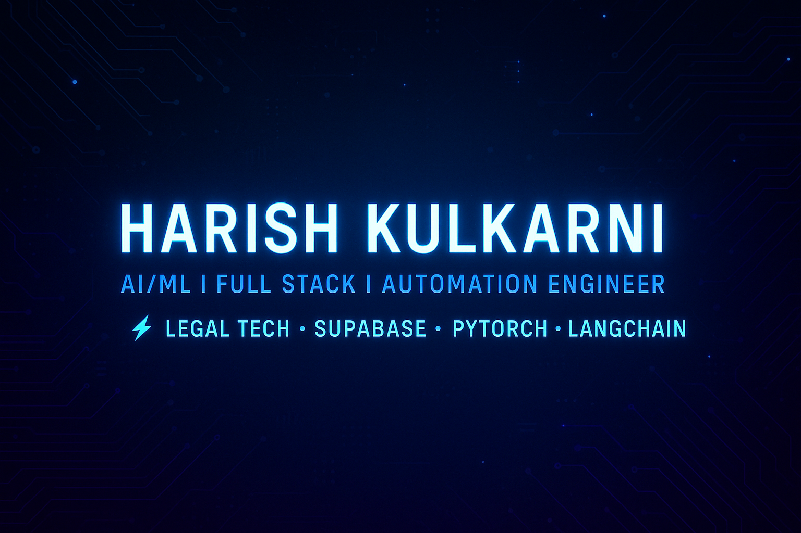

# 👋 Hi, I'm **Harish Kulkarni**  
### 🚀 AI/ML Developer | Full-Stack Engineer | Automation Enthusiast  

<p align="center">
  
</p>

Passionate about building agentic workflows, automating legal workflows & crafting smart products with AI.  
I enjoy converting ideas into powerful applications using Python, Node.js, React & Cloud technologies.

---

## 💫 What I’m Working On Right Now  
| Project | Tech | Description |
|-------|-------|-------------|
| **AI/ML Projects** | PyTorch, LangChain | Neural networks, LLM automation, agentic systems |
| **JobSearchApp** | Node.js, Supabase | Job portal with auth, filters & saved jobs |
| **sk_fitness_web_app** | TypeScript | Fitness tracker + meal planning automation |
| **EcortsCalenderBot** | Python | E-courts scraper → auto sync hearings to Google Calendar ⚖️ |

---

## 🤝 Looking to Collaborate On  
💡 AI/ML (PyTorch, LangChain, Vector DB, RAG)  
⚙️ Legal Tech (case automation, court calendar bots)  
🌍 Web Apps (React, Node, Django, FastAPI)

---

## 🧩 Need Help With  
🔹 Kubernetes deployment & scaling  
🔹 Supabase edge functions & serverless patterns  
🔹 Efficient ML model serving — ONNX / TorchServe

---

## 📚 Currently Learning  
📌 PyTorch (deep learning fundamentals & training loops)  
📌 LangChain + N8N for Agentic AI automation  
📌 Kubernetes orchestration (AKS focus)

---

## 💬 Ask Me About  
⚖️ Legal tech automation (e-courts scraping & scheduling)  
🖥️ Full-Stack (React, Python, Dockerized apps)  
📊 Data engineering & spend analytics  
🔐 Supabase Auth + RLS + Real-Time

---

## ⚡ Fun Fact  
I built a bot that syncs Indian court hearings **→ Google Calendar automatically** 🧠📅

---

## 🌐 Connect With Me  
🔗 **LinkedIn** → https://www.linkedin.com/in/harish-kulkarni-423259194  
📝 **Medium Blogs** → https://medium.com/@harishkulkarni0101  
📩 **Email** → harishkulkarni0101@gmail.com

---

## 💻 Tech Stack & Tools  
```yaml
Languages:      C#, Python, JavaScript, TypeScript, C++, Go, Java, Rust, PHP, R  
Frontend:       React, Next.js, Angular, Vue.js, HTML, CSS, SASS, Bootstrap  
Backend:        Node.js, Django, FastAPI, Express.js, Flask, .NET Core  
DB/Cloud:       Supabase, MongoDB, Postgres, MySQL, Snowflake,
                Firebase, DynamoDB, Microsoft SQL, SQLite  
AI/ML:          PyTorch, TensorFlow, Keras, Scikit-Learn, OpenCV  
DevOps:         Docker, GitHub Actions, Kubernetes, Jenkins, Cloudflare  
Analytics:      Pandas, NumPy, Matplotlib, Plotly, MLflow  
```

---

## 📊 GitHub Analytics

<p align="center">
  
  
</p>


## 🏆 Trophies  
<p align="center">
  
</p>

